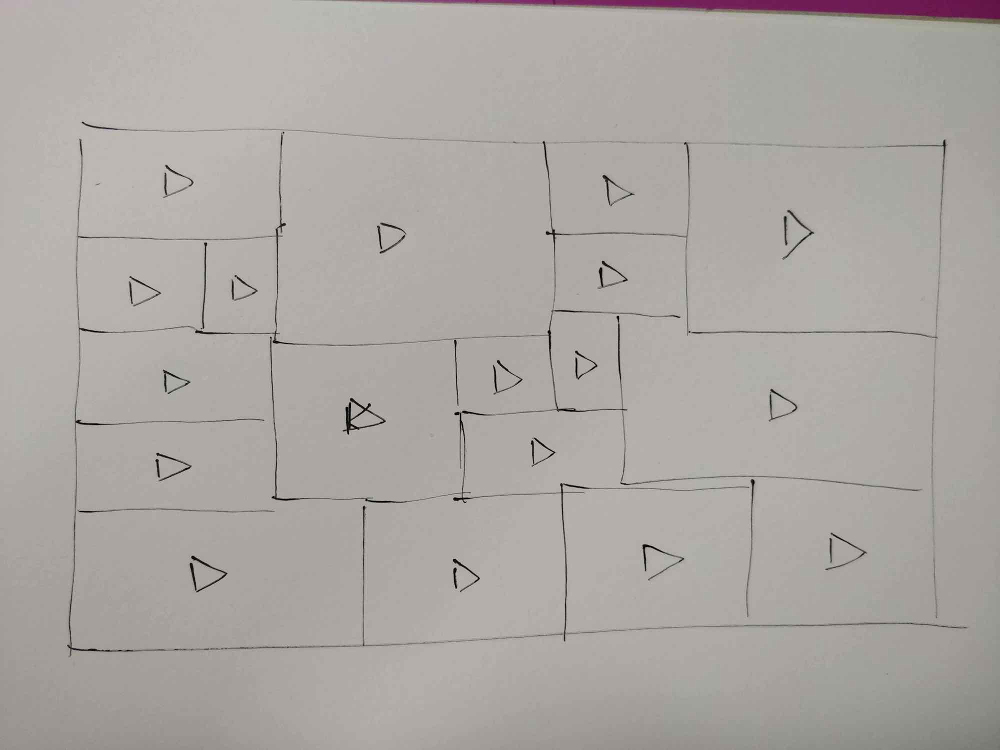
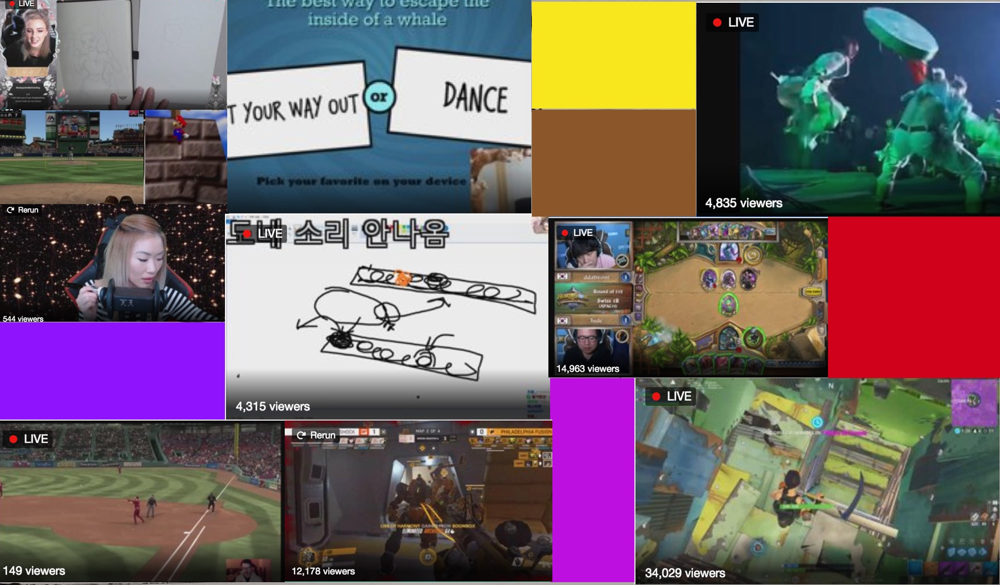
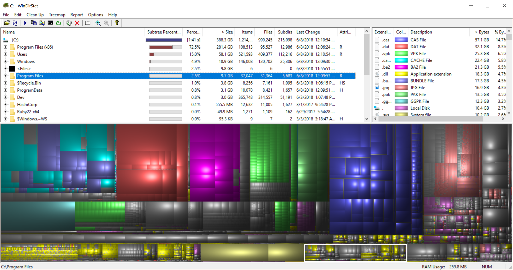

# App idea: What is Twitch: a streaming wall

Twitch https://twitch.tv is a platform for people to broadcast a live video stream to the world, and create communities around shared live experiences. Twitch is an online window the world as it exists at this moment. What does this world look like?

* Digital installation: a screen, as large and with as many pixels as possible.
* A masonry grid layout, with 16:9 boxes of varying sizes. They nest together like puzzle pieces to form a 16:9 rectangle, the whole screen.
* Each box shows a popular live stream active at that moment, say from a list of the top 50 streamers.
    * Normalise by category to show more of a cross section
* The size of each box is determined by the number of streamers watching that stream at that moment.
    * More viewers, bigger portion of the screen
* Have to decide if the focus is to actually be able to follow the content of the more popular streams or just to take in the variety (or similarity) of what's happening on Twitch

## `ａｌｇｏｒｉｔｈｍ`

* Determine how many streamers to display on the screen (ex: 20)
* Fetch the data of 20 streamers 
    * Stream embed url & viewer count, other data
    * “Top streams” - a mixture of top streams in a variety of categories. An interesting and sensible cross section.
* Make a total of the viewer count of all of the fetched streams
* For each streamer, calculate the percentage of their viewer count of that total - this is the percentage of screen that will be allotted to that video feed.
* Would the masonry layout always fit cleanly in a 16:9 space if all of the items given to it were also 16:9 and were sized as proportions of a 100% total
* Want the placement of the grid pieces, the masonry, to feel randomised. 
    * Not just largest objects in the middle, smallest around the outside. A scattered array of video streams in varying sizes. 
    * Looks random but natural that they all fit togethers
* Update at some frequency
    * MVP: Refresh every [X intervals]
    * Phase 2: natural feeling mutation of size as a stream grows and wanes in popularity. 
    * Boxes shift around the screen as they move to accommodate streams that start and end

_WinDirStat_

## Nice to haves

* A visual indicator of when “big shit” is happening in a stream
    * Watch velocity & acceleration of chat volume on each stream, so activity is normalised by that particular stream. 
    * Temporary bump in size? 
* Rotate audio streams. Switch to audio of streams where big shit is happening.

### Like this but not this

* [https://css-tricks.com/seamless-responsive-photo-grid/](https://css-tricks.com/seamless-responsive-photo-grid/)
* [masonry layout random size locked aspect ratio css js](https://www.google.com.au/search?q=masonry+layout+random+size+locked+aspect+ratio+css+js&oq=masonry+layout+random+size+locked+aspect+ratio+css+js)
* [css grid random sizes](https://www.google.com.au/search?q=css+grid+random+sizes)
* [Aspect Ratios for Grid Items - CSS Tricks Chris Coyier](https://css-tricks.com/aspect-ratios-grid-items/)

I feel like this would be most effective with the highest viewer count streams available as a way to smooth out the speed of transitions. The velocity and acceleration of viewer count would be the most reliable and least likely to spike by ridiculous percentages in viewers very quickly. Unreliable velocity would result in awkwardly-quick changes in size for particular streams. I want to watch the screen grow and change over the course of hours, with brief attention-grabbing “big moments” on those streams.

